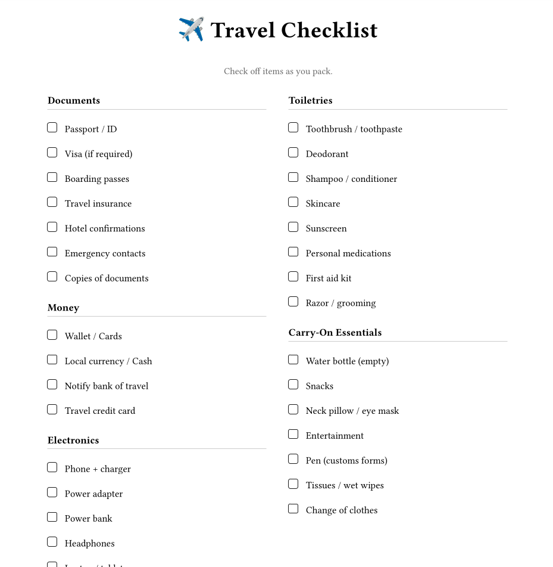

= 🧳 Travel Checklist

A typographically beautiful travel checklist generated with https://typst.app/[Typst].

== Quick Start

[source,bash]
----
# Enter the development environment
nix develop

# Or with direnv:
direnv allow

# Build the PDF
build

# Watch for changes (auto-rebuild)
watch
----

== Screenshot

== Requirements

* https://nixos.org/download.html[Nix] with flakes enabled
* https://devenv.sh/[devenv]
* (Optional) https://direnv.net/[direnv] for automatic shell activation

== Customizing

Edit `src/main.typ` to add/remove items or change the layout. The `cheq` package provides the checkbox styling. See https://typst.app/universe/package/cheq[cheq docs] for customization options.

== License

LGPL3
